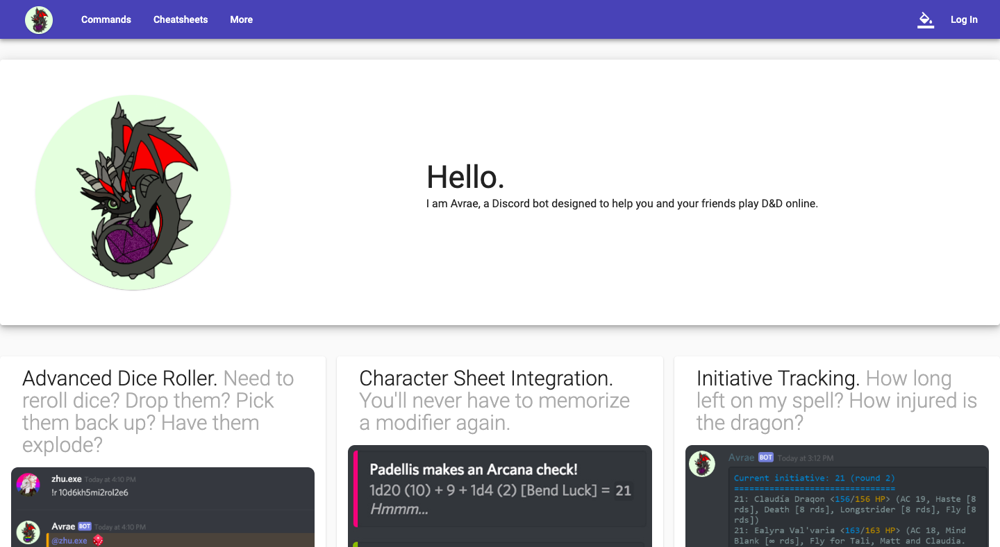

# Avrae.io 

## Important Links
- [avrae.io](https://avrae.io)
- [Support Discord Server](http://support.avrae.io)
- [D&D Beyond Discord Server](https://dndbeyond.com/discord)
- [Build](https://travis-ci.org/avrae/avrae.io)

## Overview

This is the source code for the Angular website located at https://avrae.io.  It serves as a web portal for users of the D&D Beyond Avrae Discord Bot to manage their data.

## Local Config

Edit `src/environments/environment.js#clientId` to the Discord client ID of your test application.

## Build

To build for development:

Run `npm run build:ssr`

To build for production:

Run `npm run build-prod:ssr`

## Run (Dev)

Run `npm run dev:ssr`

## Run tests

To run end to end tests:

Run `ng e2e` or `npm run e2e`

## Lint

Run `ng lint` or `npm run lint`
